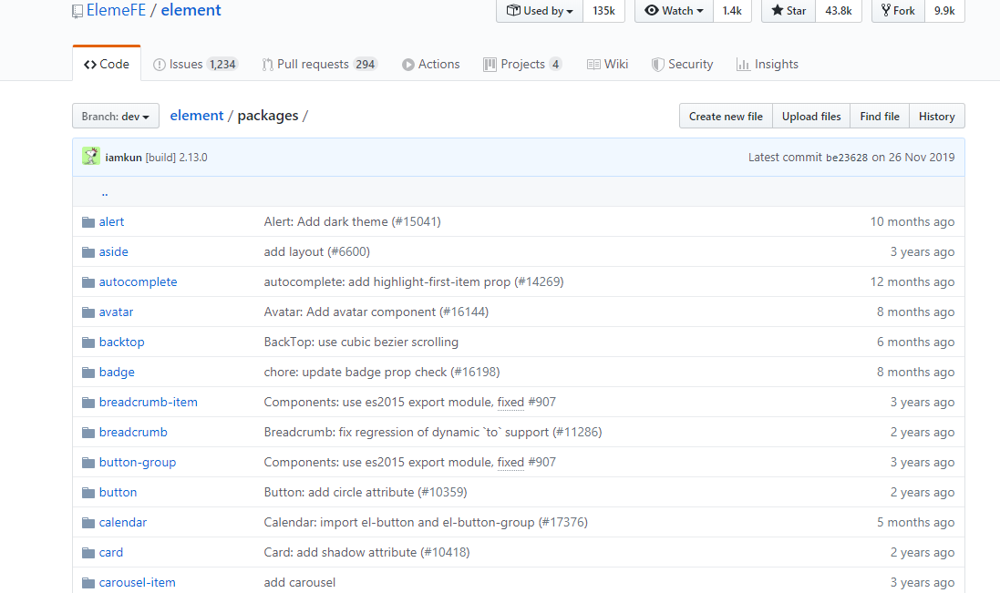

### 组件编写
> 这里主要是参考的elementUi的源码来进行相应的分析和学习的。

### elementUi源码
>通过官网进入elementUi的github，相应的组件放在packages目录中。


### 详情分析
* Input组件分析
> 相应的源码如下，通过源码能看到就一个Input组件中，已经包含了很多的props了。所以，我们在编写一个组件之前需要提前设计和讨论该组件所需要暴露出的功能点，或者提前设计好相应的功能补充的接口。
```JavaScript
<template>
  <div :class="[
    type === 'textarea' ? 'el-textarea' : 'el-input',
    inputSize ? 'el-input--' + inputSize : '',
    {
      'is-disabled': inputDisabled,
      'is-exceed': inputExceed,
      'el-input-group': $slots.prepend || $slots.append,
      'el-input-group--append': $slots.append,
      'el-input-group--prepend': $slots.prepend,
      'el-input--prefix': $slots.prefix || prefixIcon,
      'el-input--suffix': $slots.suffix || suffixIcon || clearable || showPassword
    }
    ]"
    @mouseenter="hovering = true"
    @mouseleave="hovering = false"
  >
    <template v-if="type !== 'textarea'">
      <!-- 前置元素 -->
      <div class="el-input-group__prepend" v-if="$slots.prepend">
        <slot name="prepend"></slot>
      </div>
      <input
        :tabindex="tabindex"
        v-if="type !== 'textarea'"
        class="el-input__inner"
        v-bind="$attrs"
        :type="showPassword ? (passwordVisible ? 'text': 'password') : type"
        :disabled="inputDisabled"
        :readonly="readonly"
        :autocomplete="autoComplete || autocomplete"
        ref="input"
        @compositionstart="handleCompositionStart"
        @compositionupdate="handleCompositionUpdate"
        @compositionend="handleCompositionEnd"
        @input="handleInput"
        @focus="handleFocus"
        @blur="handleBlur"
        @change="handleChange"
        :aria-label="label"
      >
      <!-- 前置内容 -->
      <span class="el-input__prefix" v-if="$slots.prefix || prefixIcon">
        <slot name="prefix"></slot>
        <i class="el-input__icon"
           v-if="prefixIcon"
           :class="prefixIcon">
        </i>
      </span>
      <!-- 后置内容 -->
      <span
        class="el-input__suffix"
        v-if="getSuffixVisible()">
        <span class="el-input__suffix-inner">
          <template v-if="!showClear || !showPwdVisible || !isWordLimitVisible">
            <slot name="suffix"></slot>
            <i class="el-input__icon"
              v-if="suffixIcon"
              :class="suffixIcon">
            </i>
          </template>
          <i v-if="showClear"
            class="el-input__icon el-icon-circle-close el-input__clear"
            @mousedown.prevent
            @click="clear"
          ></i>
          <i v-if="showPwdVisible"
            class="el-input__icon el-icon-view el-input__clear"
            @click="handlePasswordVisible"
          ></i>
          <span v-if="isWordLimitVisible" class="el-input__count">
            <span class="el-input__count-inner">
              {{ textLength }}/{{ upperLimit }}
            </span>
          </span>
        </span>
        <i class="el-input__icon"
          v-if="validateState"
          :class="['el-input__validateIcon', validateIcon]">
        </i>
      </span>
      <!-- 后置元素 -->
      <div class="el-input-group__append" v-if="$slots.append">
        <slot name="append"></slot>
      </div>
    </template>
    <textarea
      v-else
      :tabindex="tabindex"
      class="el-textarea__inner"
      @compositionstart="handleCompositionStart"
      @compositionupdate="handleCompositionUpdate"
      @compositionend="handleCompositionEnd"
      @input="handleInput"
      ref="textarea"
      v-bind="$attrs"
      :disabled="inputDisabled"
      :readonly="readonly"
      :autocomplete="autoComplete || autocomplete"
      :style="textareaStyle"
      @focus="handleFocus"
      @blur="handleBlur"
      @change="handleChange"
      :aria-label="label"
    >
    </textarea>
    <span v-if="isWordLimitVisible && type === 'textarea'" class="el-input__count">{{ textLength }}/{{ upperLimit }}</span>
  </div>
</template>
<script>
  import emitter from 'element-ui/src/mixins/emitter';
  import Migrating from 'element-ui/src/mixins/migrating';
  import calcTextareaHeight from './calcTextareaHeight';
  import merge from 'element-ui/src/utils/merge';
  import {isKorean} from 'element-ui/src/utils/shared';
  export default {
    name: 'ElInput',
    componentName: 'ElInput',
    mixins: [emitter, Migrating],
    inheritAttrs: false,
    inject: {
      elForm: {
        default: ''
      },
      elFormItem: {
        default: ''
      }
    },
    data() {
      return {
        textareaCalcStyle: {},
        hovering: false,
        focused: false,
        isComposing: false,
        passwordVisible: false
      };
    },
    props: {
      value: [String, Number],
      size: String,
      resize: String,
      form: String,
      disabled: Boolean,
      readonly: Boolean,
      type: {
        type: String,
        default: 'text'
      },
      autosize: {
        type: [Boolean, Object],
        default: false
      },
      autocomplete: {
        type: String,
        default: 'off'
      },
      /** @Deprecated in next major version */
      autoComplete: {
        type: String,
        validator(val) {
          process.env.NODE_ENV !== 'production' &&
            console.warn('[Element Warn][Input]\'auto-complete\' property will be deprecated in next major version. please use \'autocomplete\' instead.');
          return true;
        }
      },
      validateEvent: {
        type: Boolean,
        default: true
      },
      suffixIcon: String,
      prefixIcon: String,
      label: String,
      clearable: {
        type: Boolean,
        default: false
      },
      showPassword: {
        type: Boolean,
        default: false
      },
      showWordLimit: {
        type: Boolean,
        default: false
      },
      tabindex: String
    },
    computed: {
      _elFormItemSize() {
        return (this.elFormItem || {}).elFormItemSize;
      },
      validateState() {
        return this.elFormItem ? this.elFormItem.validateState : '';
      },
      needStatusIcon() {
        return this.elForm ? this.elForm.statusIcon : false;
      },
      validateIcon() {
        return {
          validating: 'el-icon-loading',
          success: 'el-icon-circle-check',
          error: 'el-icon-circle-close'
        }[this.validateState];
      },
      textareaStyle() {
        return merge({}, this.textareaCalcStyle, { resize: this.resize });
      },
      inputSize() {
        return this.size || this._elFormItemSize || (this.$ELEMENT || {}).size;
      },
      inputDisabled() {
        return this.disabled || (this.elForm || {}).disabled;
      },
      nativeInputValue() {
        return this.value === null || this.value === undefined ? '' : String(this.value);
      },
      showClear() {
        return this.clearable &&
          !this.inputDisabled &&
          !this.readonly &&
          this.nativeInputValue &&
          (this.focused || this.hovering);
      },
      showPwdVisible() {
        return this.showPassword &&
          !this.inputDisabled &&
          !this.readonly &&
          (!!this.nativeInputValue || this.focused);
      },
      isWordLimitVisible() {
        return this.showWordLimit &&
          this.$attrs.maxlength &&
          (this.type === 'text' || this.type === 'textarea') &&
          !this.inputDisabled &&
          !this.readonly &&
          !this.showPassword;
      },
      upperLimit() {
        return this.$attrs.maxlength;
      },
      textLength() {
        if (typeof this.value === 'number') {
          return String(this.value).length;
        }
        return (this.value || '').length;
      },
      inputExceed() {
        // show exceed style if length of initial value greater then maxlength
        return this.isWordLimitVisible &&
          (this.textLength > this.upperLimit);
      }
    },
    watch: {
      value(val) {
        this.$nextTick(this.resizeTextarea);
        if (this.validateEvent) {
          this.dispatch('ElFormItem', 'el.form.change', [val]);
        }
      },
      // native input value is set explicitly
      // do not use v-model / :value in template
      // see: https://github.com/ElemeFE/element/issues/14521
      nativeInputValue() {
        this.setNativeInputValue();
      },
      // when change between <input> and <textarea>,
      // update DOM dependent value and styles
      // https://github.com/ElemeFE/element/issues/14857
      type() {
        this.$nextTick(() => {
          this.setNativeInputValue();
          this.resizeTextarea();
          this.updateIconOffset();
        });
      }
    },
    methods: {
      focus() {
        this.getInput().focus();
      },
      blur() {
        this.getInput().blur();
      },
      getMigratingConfig() {
        return {
          props: {
            'icon': 'icon is removed, use suffix-icon / prefix-icon instead.',
            'on-icon-click': 'on-icon-click is removed.'
          },
          events: {
            'click': 'click is removed.'
          }
        };
      },
      handleBlur(event) {
        this.focused = false;
        this.$emit('blur', event);
        if (this.validateEvent) {
          this.dispatch('ElFormItem', 'el.form.blur', [this.value]);
        }
      },
      select() {
        this.getInput().select();
      },
      resizeTextarea() {
        if (this.$isServer) return;
        const { autosize, type } = this;
        if (type !== 'textarea') return;
        if (!autosize) {
          this.textareaCalcStyle = {
            minHeight: calcTextareaHeight(this.$refs.textarea).minHeight
          };
          return;
        }
        const minRows = autosize.minRows;
        const maxRows = autosize.maxRows;
        this.textareaCalcStyle = calcTextareaHeight(this.$refs.textarea, minRows, maxRows);
      },
      setNativeInputValue() {
        const input = this.getInput();
        if (!input) return;
        if (input.value === this.nativeInputValue) return;
        input.value = this.nativeInputValue;
      },
      handleFocus(event) {
        this.focused = true;
        this.$emit('focus', event);
      },
      handleCompositionStart() {
        this.isComposing = true;
      },
      handleCompositionUpdate(event) {
        const text = event.target.value;
        const lastCharacter = text[text.length - 1] || '';
        this.isComposing = !isKorean(lastCharacter);
      },
      handleCompositionEnd(event) {
        if (this.isComposing) {
          this.isComposing = false;
          this.handleInput(event);
        }
      },
      handleInput(event) {
        // should not emit input during composition
        // see: https://github.com/ElemeFE/element/issues/10516
        if (this.isComposing) return;
        // hack for https://github.com/ElemeFE/element/issues/8548
        // should remove the following line when we don't support IE
        if (event.target.value === this.nativeInputValue) return;
        this.$emit('input', event.target.value);
        // ensure native input value is controlled
        // see: https://github.com/ElemeFE/element/issues/12850
        this.$nextTick(this.setNativeInputValue);
      },
      handleChange(event) {
        this.$emit('change', event.target.value);
      },
      calcIconOffset(place) {
        let elList = [].slice.call(this.$el.querySelectorAll(`.el-input__${place}`) || []);
        if (!elList.length) return;
        let el = null;
        for (let i = 0; i < elList.length; i++) {
          if (elList[i].parentNode === this.$el) {
            el = elList[i];
            break;
          }
        }
        if (!el) return;
        const pendantMap = {
          suffix: 'append',
          prefix: 'prepend'
        };
        const pendant = pendantMap[place];
        if (this.$slots[pendant]) {
          el.style.transform = `translateX(${place === 'suffix' ? '-' : ''}${this.$el.querySelector(`.el-input-group__${pendant}`).offsetWidth}px)`;
        } else {
          el.removeAttribute('style');
        }
      },
      updateIconOffset() {
        this.calcIconOffset('prefix');
        this.calcIconOffset('suffix');
      },
      clear() {
        this.$emit('input', '');
        this.$emit('change', '');
        this.$emit('clear');
      },
      handlePasswordVisible() {
        this.passwordVisible = !this.passwordVisible;
        this.focus();
      },
      getInput() {
        return this.$refs.input || this.$refs.textarea;
      },
      getSuffixVisible() {
        return this.$slots.suffix ||
          this.suffixIcon ||
          this.showClear ||
          this.showPassword ||
          this.isWordLimitVisible ||
          (this.validateState && this.needStatusIcon);
      }
    },
    created() {
      this.$on('inputSelect', this.select);
    },
    mounted() {
      this.setNativeInputValue();
      this.resizeTextarea();
      this.updateIconOffset();
    },
    updated() {
      this.$nextTick(this.updateIconOffset);
    }
  };
</script>
```
