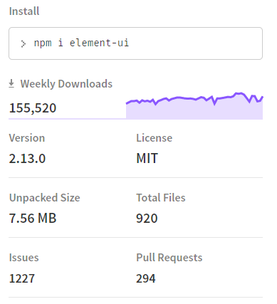
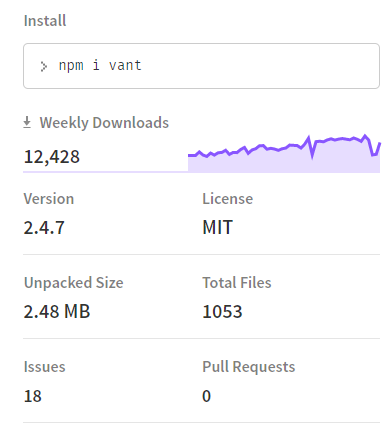
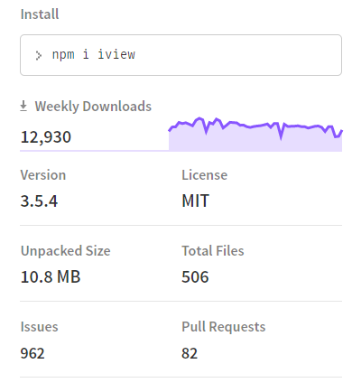
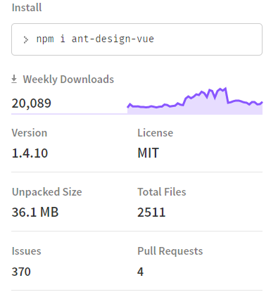

### 各类组件的优缺点调研
> 这里主要是调研elementUI、Vant、ant-design-vue、iView。对比其使用率、组件库丰富度、API风格、项目优化等进行比较。

### 使用率
> 这里主要是根据star数、npm 平均下载频率等进行对比

|  组件库   |      star数      |  npm下载数(week) |
|:----------:|:-------------:|:------:|
| element |  43.7k | 155,520 |
| vant |    12.6k   |   12,428 |
| iView | 1.1k |    12,930 |
| ant-design-vue | 9.3k |    20,089 |

>下面是其他的一些信息对比






> 数据差异也和发布时间，以及库是否发生过迁移有关。总体来说elementUi的star数、npm下载数、开发者团队等都是最多的，同时issue和bug也是最多的（由于使用的人数比较多）。除此之外，element也提供了一些额外的功能，其中包含了自定义主题设置以及对设计比较友好的Axure Components和Sketch Template。

### 组件库丰富度
> 随着版本库的不断迭代，各个组件库之间功能上的差异也是越来越小了，基本上所包含的组件种类都大同小异，针对不同注重的方向会有一部分特定组件的编写，只是一些组件的使用上会有一定的区别。主要包含的组件如下：

|   组件   |      element      |  vant | iView | ant-design-vue |
|:----------:|:-------------:|:------:|:-------------:|:------:|
| 国际化 |  √ | √ | √ |  √ |
| 自定义主题 |    √    |   √ | √ |  √ |
| 内置过渡动画 | √  |   X | X |
| Layout | √  |    √ | √ |  √ |
| contaner | √  |    X | √ |  √ |
| 单元格 | X  |    √ | √ |   X |
| color | √  |    √ | √ |   √ |
| 字体 | √  |    X | √ |   X |
| border | √  |    X | X |   X |
| Icon | √  |    √ |  √ |  √ |
| Button | √  |    √ |  √ |  √ |
| Link | √  |   X |  X |   X |
| Radio | √  |    √ |  √ |  √ |
| checkBox | √  |    √ |  √ |  √ |
| Input | √  |    √ |  √ |  √ |
| InputNumber 计数器 | √  |    √ |  √ |  √ |
| 密码输入框 | X  |    √ |  X |   X |
| 搜索框 | X  |    √ |  X |   X |
| Select | √  |    √ |   √ |  √ |
| 级联选择器 | √  |    X |   √ |  √ |
| Switch 开关 | √  |    √ |   √ |  √ |
| Slider 滑块 | √  |    √ |   √ |  √ |
| 时间选择器 | √  |    √ |   √ |  √ |
| 日期选择器 | √  |    X |   √ |  √ |
| 日期时间选择器 | √  |    X |  X |  X |
| Upload 上传 | √  |    √ |  √ |  √ |
| Rate 评分 | √  |    √ |  √ |  √ |
| ColorPick 颜色选择器 | √  |    X |   √ |   X |
| Transfer 穿梭框 | √  |    X |   √ |  √ |
| Form 表单 | √  |    X |   √ |  √ |
| Table | √  |    X |   √ |  √ |
| Tag 标签 | √  |    √ |  √ |  √ |
| progress 进度条 | √  |    √ |  √  |  √ |
| Tree 树型控件 | √  |    X |   √ |  √ |
| 分页 | √  |    √ | √ |  √ |
| 标记 | √  |    √ | √ |  √ |
| 锚点 | X  |    X | √ |   √ |
| 头像 | √  |    X |  √ |  √ |
| Alert 警告 | √  |    √ |   √ |  √ |
| Loading 加载 | √  |    √ |  √ |   √ |
| Message 消息提醒 | √  |    √ |   √ |  √ |
| 弹框 | √  |    √ |  X |  √ |
| 通知 | √  |    √ |  √ |   √ |
| 导航菜单 | √  |    √ | √ |  √ |
| 标签页 | √  |    √ | √ |  √ |
| 面包屑 | √  |    √ | √ |  √ |
| 页头 | √  |    X |  X |   X |
| 下拉菜单 | √  |    √ | √ |  √ |
| 上拉菜单 | X  |    √ | X |  X |
| 遮罩层 | X  |    √ |  X |   X |
| 下拉刷新 | X  |    √ |  X |   X |
| 滑动单元格 | X  |    √ |  X |   X |
| 进度条 | X  |    √ |  √ |   √ |
| 倒计时 | X  |    √ |  X |  X |
| 步骤条 | √  |    √ |  √ |  √ |
| 对话框 | √  |    X |  √ |  √ |
| 文字提示 | √  |    √ |  √ |  √ |
| 弹出框 | √  |    √ |  √ |  √ |
| 气泡确认框 | √  |    X |  √ |  √ |
| 卡片 | √  |    √ | √ |  √ |
| 走马灯 | √  |    √ |  √ |  √ |
| 折叠面板 | √  |    √ |  √ |  √ |
| 评论 | X  |    X |  X |  √ |
| 空状态 | X  |    X |  X |  √ |
| 骨架屏 | X  |    √ |  X |  √ |
| 统计数值 | X  |    X |  X |  √ |
| 面板分割 | X  |    X |  √ |   X |
| 时间线 | √  |    √ |  √ |  √ |
| 相对时间 | X  |    X |  √ |   X |
| 分割线 | √  |    √ |  √ |   √ |
| 日历 | √  |    √ |  X |  √ |
| 图片 | √  |    √ | X |    X |
| 图片懒加载 | X  |    √ |  X |   X |
| 回到顶部 | √  |    √ |  √ |   √ |
| 无限滚动 | √  |    X | √ |   X |
| 抽屉 | √  |    X |  √ |  √ |
>其中有些功能不同组件库中可能有合并，其中Icon组件所对应的图标，elementUi中提供的比较少。


### API风格
>API风格主要是通过一些组件的使用，以及渲染方式来进行对比。这里主要是对比form 和 table组件
* form
```Html
<!-- element -->
<el-form ref="form" :model="form" label-width="80px">
  <el-form-item label="活动名称">
    <el-input v-model="form.name"></el-input>
  </el-form-item>
  <el-form-item label="活动区域">
    <el-select v-model="form.region" placeholder="请选择活动区域">
      <el-option label="区域一" value="shanghai"></el-option>
      <el-option label="区域二" value="beijing"></el-option>
    </el-select>
  </el-form-item>
  <el-form-item label="活动时间">
    <el-col :span="11">
      <el-date-picker type="date" placeholder="选择日期" v-model="form.date1" style="width: 100%;"></el-date-picker>
    </el-col>
    <el-col class="line" :span="2">-</el-col>
    <el-col :span="11">
      <el-time-picker placeholder="选择时间" v-model="form.date2" style="width: 100%;"></el-time-picker>
    </el-col>
  </el-form-item>
  <el-form-item label="即时配送">
    <el-switch v-model="form.delivery"></el-switch>
  </el-form-item>
  <el-form-item label="活动性质">
    <el-checkbox-group v-model="form.type">
      <el-checkbox label="美食/餐厅线上活动" name="type"></el-checkbox>
      <el-checkbox label="地推活动" name="type"></el-checkbox>
      <el-checkbox label="线下主题活动" name="type"></el-checkbox>
      <el-checkbox label="单纯品牌曝光" name="type"></el-checkbox>
    </el-checkbox-group>
  </el-form-item>
  <el-form-item label="特殊资源">
    <el-radio-group v-model="form.resource">
      <el-radio label="线上品牌商赞助"></el-radio>
      <el-radio label="线下场地免费"></el-radio>
    </el-radio-group>
  </el-form-item>
  <el-form-item label="活动形式">
    <el-input type="textarea" v-model="form.desc"></el-input>
  </el-form-item>
  <el-form-item>
    <el-button type="primary" @click="onSubmit">立即创建</el-button>
    <el-button>取消</el-button>
  </el-form-item>
</el-form>

<!-- vant 没有整个的form组件-->

<!-- iView -->
<Form :model="formItem" :label-width="80">
    <FormItem label="Input">
        <Input v-model="formItem.input" placeholder="Enter something..."></Input>
    </FormItem>
    <FormItem label="Select">
        <Select v-model="formItem.select">
            <Option value="beijing">New York</Option>
            <Option value="shanghai">London</Option>
            <Option value="shenzhen">Sydney</Option>
        </Select>
    </FormItem>
    <FormItem label="DatePicker">
        <Row>
            <Col span="11">
                <DatePicker type="date" placeholder="Select date" v-model="formItem.date"></DatePicker>
            </Col>
            <Col span="2" style="text-align: center">-</Col>
            <Col span="11">
                <TimePicker type="time" placeholder="Select time" v-model="formItem.time"></TimePicker>
            </Col>
        </Row>
    </FormItem>
    <FormItem label="Radio">
        <RadioGroup v-model="formItem.radio">
            <Radio label="male">Male</Radio>
            <Radio label="female">Female</Radio>
        </RadioGroup>
    </FormItem>
    <FormItem label="Checkbox">
        <CheckboxGroup v-model="formItem.checkbox">
            <Checkbox label="Eat"></Checkbox>
            <Checkbox label="Sleep"></Checkbox>
            <Checkbox label="Run"></Checkbox>
            <Checkbox label="Movie"></Checkbox>
        </CheckboxGroup>
    </FormItem>
    <FormItem label="Switch">
        <i-switch v-model="formItem.switch" size="large">
            <span slot="open">On</span>
            <span slot="close">Off</span>
        </i-switch>
    </FormItem>
    <FormItem label="Slider">
        <Slider v-model="formItem.slider" range></Slider>
    </FormItem>
    <FormItem label="Text">
        <Input v-model="formItem.textarea" type="textarea" :autosize="{minRows: 2,maxRows: 5}" placeholder="Enter something..."></Input>
    </FormItem>
    <FormItem>
        <Button type="primary">Submit</Button>
        <Button style="margin-left: 8px">Cancel</Button>
    </FormItem>
</Form>


<!-- ant-design-vue -->
<a-form>
    <a-form-item
      :label-col="labelCol"
      :wrapper-col="wrapperCol"
      label="Fail"
      validate-status="error"
      help="Should be combination of numbers & alphabets"
    >
      <a-input id="error" placeholder="unavailable choice" />
    </a-form-item>

    <a-form-item
      :label-col="labelCol"
      :wrapper-col="wrapperCol"
      label="Warning"
      validate-status="warning"
    >
      <a-input id="warning" placeholder="Warning" />
    </a-form-item>

    <a-form-item
      :label-col="labelCol"
      :wrapper-col="wrapperCol"
      label="Validating"
      has-feedback
      validate-status="validating"
      help="The information is being validated..."
    >
      <a-input id="validating" placeholder="I'm the content is being validated" />
    </a-form-item>

    <a-form-item
      :label-col="labelCol"
      :wrapper-col="wrapperCol"
      label="Success"
      has-feedback
      validate-status="success"
    >
      <a-input id="success" placeholder="I'm the content" />
    </a-form-item>

    <a-form-item
      :label-col="labelCol"
      :wrapper-col="wrapperCol"
      label="Warning"
      has-feedback
      validate-status="warning"
    >
      <a-input id="warning2" placeholder="Warning" />
    </a-form-item>

    <a-form-item
      :label-col="labelCol"
      :wrapper-col="wrapperCol"
      label="Fail"
      has-feedback
      validate-status="error"
      help="Should be combination of numbers & alphabets"
    >
      <a-input id="error2" placeholder="unavailable choice" />
    </a-form-item>

    <a-form-item
      :label-col="labelCol"
      :wrapper-col="wrapperCol"
      label="Success"
      has-feedback
      validate-status="success"
    >
      <a-date-picker style="width: 100%" />
    </a-form-item>

    <a-form-item
      :label-col="labelCol"
      :wrapper-col="wrapperCol"
      label="Warning"
      has-feedback
      validate-status="warning"
    >
      <a-time-picker style="width: 100%" />
    </a-form-item>

    <a-form-item
      :label-col="labelCol"
      :wrapper-col="wrapperCol"
      label="Error"
      has-feedback
      validate-status="error"
    >
      <a-select default-value="1">
        <a-select-option value="1">
          Option 1
        </a-select-option>
        <a-select-option value="2">
          Option 2
        </a-select-option>
        <a-select-option value="3">
          Option 3
        </a-select-option>
      </a-select>
    </a-form-item>

    <a-form-item
      :label-col="labelCol"
      :wrapper-col="wrapperCol"
      label="Validating"
      has-feedback
      validate-status="validating"
      help="The information is being validated..."
    >
      <a-cascader :default-value="['1']" :options="[]" />
    </a-form-item>

    <a-form-item
      label="inline"
      :label-col="labelCol"
      :wrapper-col="wrapperCol"
      style="margin-bottom:0;"
    >
      <a-form-item
        validate-status="error"
        help="Please select the correct date"
        :style="{ display: 'inline-block', width: 'calc(50% - 12px)' }"
      >
        <a-date-picker style="width: 100%" />
      </a-form-item>
      <span :style="{ display: 'inline-block', width: '24px', textAlign: 'center' }">
        -
      </span>
      <a-form-item :style="{ display: 'inline-block', width: 'calc(50% - 12px)' }">
        <a-date-picker style="width: 100%" />
      </a-form-item>
    </a-form-item>

    <a-form-item
      :label-col="labelCol"
      :wrapper-col="wrapperCol"
      label="Success"
      has-feedback
      validate-status="success"
    >
      <a-input-number style="width: 100%" />
    </a-form-item>
  </a-form>
```
>form表单来看，使用基本上都差不多，但个人感觉iview和ant使用起来会更加的简洁一点（iView和ant更类似一点）。提供的一些参数和方法也都比较齐全和类似。

* table
```Html
<!-- element -->
 <el-table
  :data="tableData"
  style="width: 100%">
  <el-table-column
    prop="date"
    label="日期"
    width="180">
  </el-table-column>
  <el-table-column
    prop="name"
    label="姓名"
    width="180">
  </el-table-column>
  <el-table-column
    prop="address"
    label="地址">
  </el-table-column>
</el-table>

<!-- vant 无table（主要是移动端的UI）-->

<!-- iView -->
<Table :columns="columns1" :data="data1"></Table>

<!-- ant-design-vue -->
<a-table
    :columns="columns"
    :rowKey="record => record.login.uuid"
    :dataSource="data"
    :pagination="pagination"
    :loading="loading"
    @change="handleTableChange"
  >
  </a-table>
```
>table iview和ant 要比element 简洁许多。在生成类似表格 下拉框这些较复杂的组件时 ， iview 的方式类似于antdesign , 好处是直接传数据进去，在内部实现了模板生成，高效 快捷。 而element 则是用到到v-for vue指令结合的方式去生成，批量生成元素。

### 项目优化
>第三方组件库依赖过大 会给首屏加载带来很大的压力，一般解决方式是 按需求引入组件， 只引入需要使用的组件。下面就简单介绍一下各个组件库按需引入的方式。
* element
>借助 babel-plugin-component，只引入需要的组件，以达到减小项目体积的目的。安装依赖之后进行相应的配置。
```JavaScript
/* .babelrc */
{
  "presets": [["es2015", { "modules": false }]],
  "plugins": [
    [
      "component",
      {
        "libraryName": "element-ui",
        "styleLibraryName": "theme-chalk"
      }
    ]
  ]
}
```

* vant
>使用babel-plugin-import 插件，它会在编译过程中将 import 的写法自动转换为按需引入的方式。安装依赖之后进行相应的配置。如果使用 TypeScript，可以使用 ts-import-plugin 实现按需引入。
```JavaScript
/* .babelrc */
{
  "plugins": [
    ["import", {
      "libraryName": "vant",
      "libraryDirectory": "es",
      "style": true
    }]
  ]
}
```

* iView
>和vant相同，也是使用的babel-plugin-import。首先安装，并在文件 .babelrc 中配置：
```JavaScript
{
  "plugins": [["import", {
    "libraryName": "iview",
    "libraryDirectory": "src/components"
  }]]
}
```

* ant-design-vue
>同样的也是使用的babel-plugin-import。首先安装，并在文件 .babelrc 中配置：
```JavaScript
{
  "plugins": [["import", {
    "libraryName": "ant-design-vue",
    "libraryDirectory": "es", 
    "style": "css"
  }]]
}
```

### 针对对象
> 根据各个组件库官网的介绍，能够大概知道其各自对应的不同端
>Element，一套为开发者、设计师和产品经理准备的基于 Vue 2.0 的桌面端组件库
>Vant Weapp 是移动端 Vue 组件库 Vant 的小程序版本，两者基于相同的视觉规范，提供一致的 API 接口，助力开发者快速搭建小程序应用。
>View UI，即原先的 iView，是一套基于 Vue.js 的开源 UI 组件库，主要服务于 PC 界面的中后台产品。
>ant-design-vue 开发和服务于企业级后台产品。