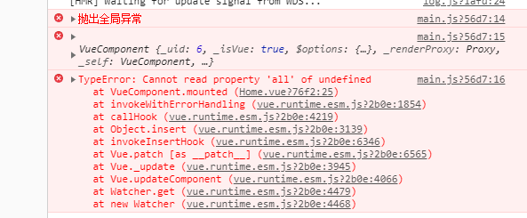

### 全局错误收集
> 主要目的是将项目运行中出现的错误收集起来（需要后端接口配合），便于找出问题，准确快速的修改错误，减少错误带来的损失。其中主要又包含了两种，一个是代码上的错误（主要是没考虑到一些情况如：后端返回数据的可能性、一些方法的兼容性等）。除此之外，还有接口的报错。

### 代码上的错误
>由于使用的是vue框架，可以直接使用官方推荐的vue.config.errorHandler来捕获代码上出现的错误。指定组件的渲染和观察期间未捕获错误的处理函数。这个处理函数被调用时，可获取错误信息和 Vue 实例。
```JavaScript
const errorHandler = (error, vm) => {
  // 调用相应的接口上传报错
  console.error('抛出全局异常')
  console.error(vm)
  console.error(error)
}
Vue.config.errorHandler = errorHandler
```


### 接口上的错误
> 由于请求使用的axios，我们就可以通过拦截器拦截相应的请求和响应统一处理接口中出现的问题
```JavaScript
service.interceptors.request.use((config) => {
  // Do something before request is sent
  return config
}, function (error) {
  // Do something with request error
  // 上报相应的错误
  return Promise.reject(error)
})

service.interceptors.response.use((response) => {
  if (response.data.status) {
    return response.data.data
  } else {
    // 上报相应的错误
    return Promise.reject(response.data.description)
  }
}, (error) => {
  // 上报相应的错误
  return Promise.reject(error)
})
```