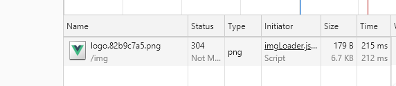

### 简介
> 图片预加载就是在进入主页面之前，会将引入的一些图片预先加载到浏览器中它保证了图片快速、无缝地发布，也可帮助用户在浏览网站内容时获得更好的用户体验。当页面中需要loading页时也可以来作为页面加载的百分比数据。

### 整体实现
> 主要包含两个js文件，一个用来导出需要预加载的图片名称，另一个来进行预加载功能的实现

### loader.js
> 主要是通过new Image后的onload来实现预加载，同时设置了一次的最大加载数。最终暴露出去的函数用户可以传递加载数和一个回调函数（接受当前加载的进度为参数）
```JavaScript
import list from './imgList'

let imgCount = list.length
let lists = [].concat(list)
let url = lists.map((item) => require(`../images/${item}`))
let loadCount = 0
let loadProcess = 0
let totalCount = list.length

function loadHandler (url) {
  return new Promise((resolve, reject) => {
    let img = new Image()
    img.onload = function () {
      loadCount++
      loadProcess = parseInt((loadCount / totalCount) * 100, 10)
      return resolve(url)
    }
    img.onerror = reject
    img.src = url
  })
}

function loadWarpHandler (url, handler) {
  let promise = handler(url).then(img => ({
    img,
    index: promise
  }))
  return promise
}

function imgLoaders (options) {
  let {
    limit,
    url,
    handler
  } = options
  let requestImgs = url.splice(0, limit).map(url => {
    return loadWarpHandler(url, handler)
  })
  if (imgCount < limit) {
    return Promise.all(requestImgs)
  }
  url.reduce((last, url) => {
    return last.then(() => {
      return Promise.race(requestImgs)
    }).then((res) => {
      var posIndex = requestImgs.findIndex((item) => {
        return item === res.index
      })
      requestImgs.splice(posIndex, 1)
      requestImgs.push(loadWarpHandler(url, handler))
    }).catch(error => {
      console.log(error)
    })
  }, Promise.resolve())
    .then(() => {
      return Promise.all(requestImgs)
    })
}

function imgLoadersStart (options) {
  let process = 0
  var {
    limit = 5, Process
  } = options
  imgLoaders({
    limit,
    url,
    handler: loadHandler
  })
  // debug
  // 递归来加数字
  let numberGrow = () => {
    let accTimer = setTimeout(() => {
      if (process < loadProcess) {
        process++
      }
      Process(process)
      if (process < 100) {
        numberGrow()
      } else {
        clearTimeout(accTimer)
      }
    }, 20)
  }
  numberGrow()
}

// 开始执行
export default (imgLoadersStart)
```

>当进入页面之后，图片就会被加载
