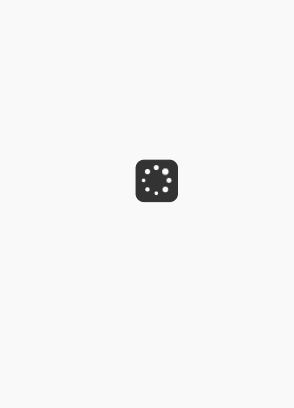

### 组件简介
> loading组件主要是在请求和响应等待过程中，给用户相应的提示表示还是等待中。

### 代码
> 控制显示的变量存放在vuex，修改时可以通过mutation修改
```JavaScript
<template>
  <div v-show="isMum" :class="$style.pending_wrapper">
    <div class="pending_box">
      <div id="loading-center-absolute">
        <div class="object" id="object_one"></div>
        <div class="object" id="object_two"></div>
        <div class="object" id="object_three"></div>
        <div class="object" id="object_four"></div>
        <div class="object" id="object_five"></div>
        <div class="object" id="object_six"></div>
        <div class="object" id="object_seven"></div>
        <div class="object" id="object_eight"></div>
      </div>
    </div>
  </div>
</template>

<script>
import { mapGetters } from 'vuex'
export default {
  computed: {
    ...mapGetters({
      isMum: 'home/isMum'
    })
  }
}
</script>

<style module lang="scss">
  .pending_wrapper {
    top: 0;
    left: 0;
    right: 0;
    bottom: 0;
    z-index: 10000;
    position: fixed;
    :global {
      .pending_box {
        top: 50%;
        left: 50%;
        width: px2rem(50px);
        height: px2rem(50px);
        display: block;
        position: absolute;
        border-radius: 10px;
        transform: translate(-50%, -50%);
        background-color: rgba(0,0,0, 0.8);
        #loading-center-absolute {
          top: 50%;
          left: 50%;
          width: px2rem(35px);
          height: px2rem(35px);
          position: absolute;
          border-radius: 50% 50% 50% 50%;
          transform: translate(-50%, -50%);
          .object :local{
            width: 13.3%;
            height: 13.3%;
            position: absolute;
            background-color: #FFF;
            border-radius: 50% 50% 50% 50%;
            animation: animate 0.8s infinite;
          }
          #object_one {
            top: 12.6%;
            left: 12.6%;
          }
          #object_two {
            top: 0px;
            left: 43.2%;
            animation-delay: 0.1s;
          }
          #object_three {
            top: 12.6%;
            left: 74%;
            animation-delay: 0.2s;
          }
          #object_four {
            top: 43.2%;
            left: 86.7%;
            animation-delay: 0.3s;
          }
          #object_five {
            top: 74%;
            left: 74%;
            animation-delay: 0.4s;
          }
          #object_six {
            top: 86.7%;
            left: 43.2%;
            animation-delay: 0.5s;
          }
          #object_seven {
            top: 74%;
            left: 12.6%;
            animation-delay: 0.6s;
          }
          #object_eight {
            top: 43.2%;
            left: 0px;
            animation-delay: 0.7s;
          }
          @keyframes animate {
            50% {
              transform: scale(1.5,1.5);
            }
            100% {
              transform: scale(1,1);
            }
          }
        }
      }
    }
  }
</style>
```
